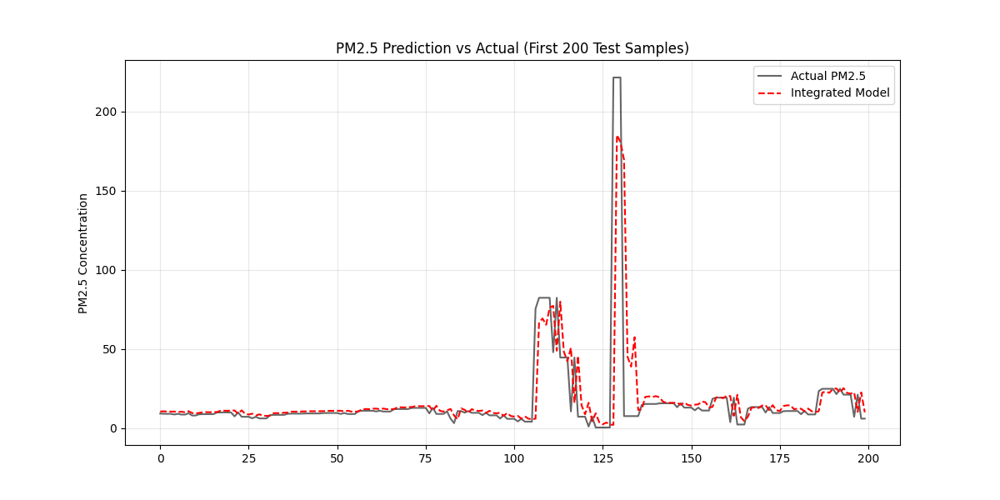

# Raipur Air Pollution — Integrated Regression Framework

> PM2.5 prediction across four monitoring stations using a 3-phase ML pipeline with stacking ensemble.

---

## Project Overview

This project builds an **Integrated Regression Framework** for predicting PM2.5 concentrations at four air quality monitoring stations in Raipur, India:

| Station | Location |
|---------|----------|
| AIIMS | All India Institute of Medical Sciences, Raipur |
| Bhatagaon | Bhatagaon, Raipur |
| IGKV | Indira Gandhi Krishi Vishwavidyalaya, Raipur |
| Silatara | Silatara Industrial Area, Raipur |

Raw DCR (Daily Continuous Recording) data spanning **2022–2026** is ingested, cleaned, feature-engineered, and fed into a stacking ensemble that outperforms all individual base learners.

---

## Pipeline

### Phase 1 — Data Ingestion (`1_combine_raw_csvs.py`)

- Recursively scans all four station folders for `.csv` files
- Dynamically detects the real header row by scanning for `"Date & Time"`
- Drops phantom `Unnamed` columns caused by trailing commas in the source files
- Strips units rows, summary rows (Min / Max / Total), and empty rows
- Adds `station`, `source_file`, and `source_sheet` metadata columns
- Outputs a single merged Parquet file: `artifacts/data_15min.parquet`
  - **872,208 rows × 139 columns** across all four stations

### Phase 2 — Feature Engineering (`2_preprocess_and_features.py`)

- **24:00 time fix**: Converts midnight timestamps written as `24:00` to `00:00` of the next day, preventing parse failures
- **Cyclical encoding**: Encodes `hour`, `day_of_week`, and `month` as sine/cosine pairs so the model understands temporal periodicity (e.g. hour 23 is close to hour 0)
- Lag features, rolling statistics, and meteorological interaction terms
- Train / validation / test split with no data leakage
- Outputs: `artifacts/features_train.parquet`, `features_val.parquet`, `features_test.parquet`

### Phase 3 — Stacking Ensemble (`3_train_and_evaluate.py`)

- **Base learners**: Linear Regression, Random Forest, XGBoost
- **Meta-learner**: Ridge regression trained on out-of-fold predictions from base learners
- Evaluation on held-out test set with R², RMSE, and MAE
- Generates `artifacts/final_results_plot.png` and `artifacts/model_config.json`

---

## Results

### Performance Metrics

| Model | R² Score |
|-------|----------|
| Linear Regression | 0.5440 |
| Random Forest | 0.5355 |
| XGBoost | 0.4749 |
| **Integrated Model (Stacking)** | **0.5974** |

The stacking ensemble achieves a **+5.3 pp improvement** over the best individual model (Linear Regression), demonstrating the value of combining diverse learners.

### Results Gallery



---

## Repository Structure

```
.
├── 1_combine_raw_csvs.py        # Phase 1: Data ingestion
├── 2_preprocess_and_features.py # Phase 2: Feature engineering
├── 3_train_and_evaluate.py      # Phase 3: Model training & evaluation
├── artifacts/
│   ├── data_15min.parquet       # Merged raw data (all stations)
│   ├── features_train.parquet   # Training features
│   ├── features_val.parquet     # Validation features
│   ├── features_test.parquet    # Test features
│   ├── model_config.json        # Model hyperparameters & metadata
│   └── final_results_plot.png   # Performance comparison chart
└── README.md
```

---

## Quick Start

```bash
# 1. Ingest and merge raw CSVs
python 1_combine_raw_csvs.py

# 2. Engineer features
python 2_preprocess_and_features.py

# 3. Train and evaluate
python 3_train_and_evaluate.py
```

---

## Data Sources

Raw data sourced from Continuous Ambient Air Quality Monitoring Stations (CAAQMS) operated under the Chhattisgarh Environment Conservation Board (CECB), covering pollutants: NO, NO₂, NOₓ, SO₂, O₃, PM10, PM2.5, Benzene, CO, NH₃, and meteorological parameters (WS, WD, Temp, Humidity, Solar Radiation, Rainfall).
